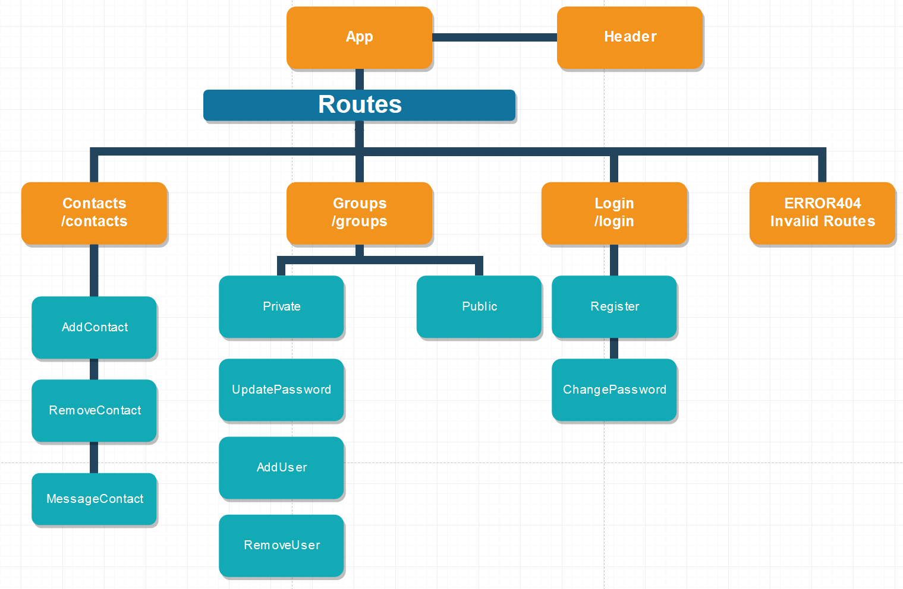

# Capstone Project Planning

## Author

  * Steven Colburn

## Diagram

## Project Description

### Name of Student: Steven Colburn

### Name of Project: Groups (undecided on name)

### Project’s Purpose or Goal:

    * Add, removed and message contacts
    * Create public and private groups
    * Public groups anyone can join
    * Private groups are password protected
    * List of groups
        * Public and Private are separated
    * Public groups
        * Listed as long as you know the name of the group
    * Private groups
        * Require the user to know both the name and password which will then add them to the group  

### List the absolute minimum features the project requires to meet this purpose or goal:

    * SQL Server   
    * Create and remove user accounts  
    * Users can create public and private groups  
        * private groups require a password  
    * Users can add contacts by typing in a username and sending a request to the other person  

### What tools, frameworks, libraries, APIs, modules and/or other resources (whatever is specific to your track, and your language) will you use to create this MVP? List them all here. Be specific.

    * Javascript
    * React
    * SQL Server
    * uuid
    * bootstrap

### If you finish developing the minimum viable product (MVP) with time to spare, what will you work on next? Describe these features here: Be specific.

If I finish the MVP I want to learn how to properly encrypt user passwords so they aren't stored via clear text. I would also be interested in learning how to implement voice chat based on how users can chat via roll20 or discord  

    * Password Encryption  
    * Voice Chat  
        * Roll20  
        * Discord  

### What additional tools, frameworks, libraries, APIs, or other resources will these additional features require?

I am currently unsure what tools I would need for a voice chat feature or for properly storing encrypted passwords.  

### Is there anything else you’d like your instructor to know?

I don't currently have any questions but I do plan on polishing the goals for the project first.  
